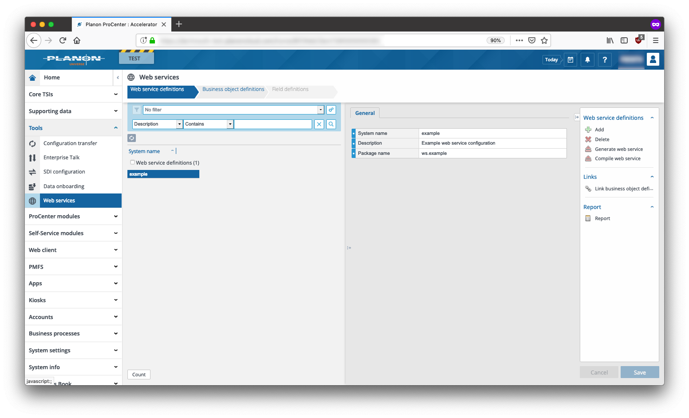
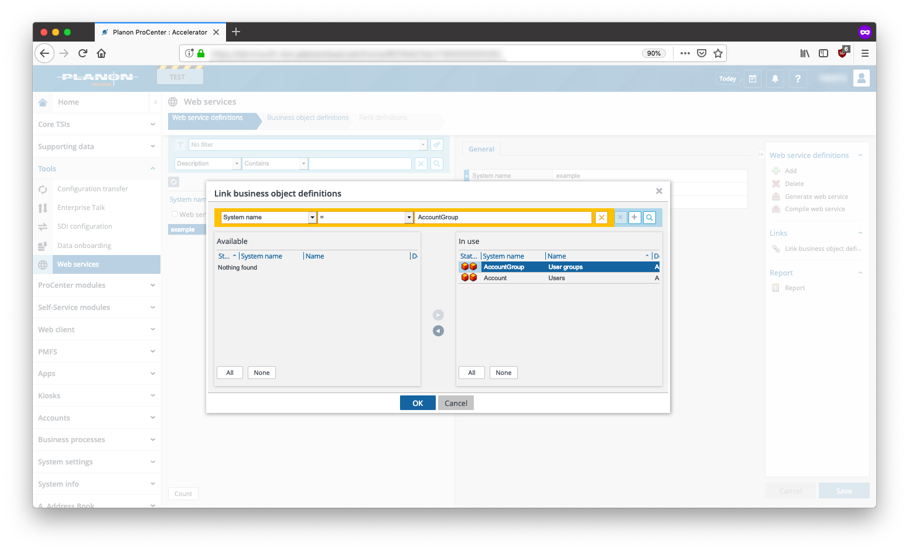
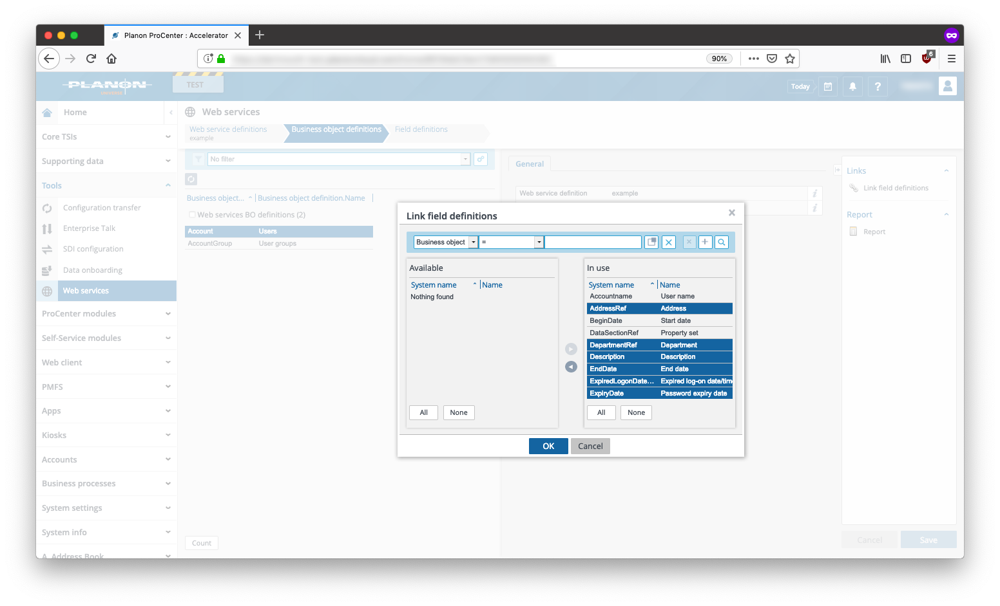
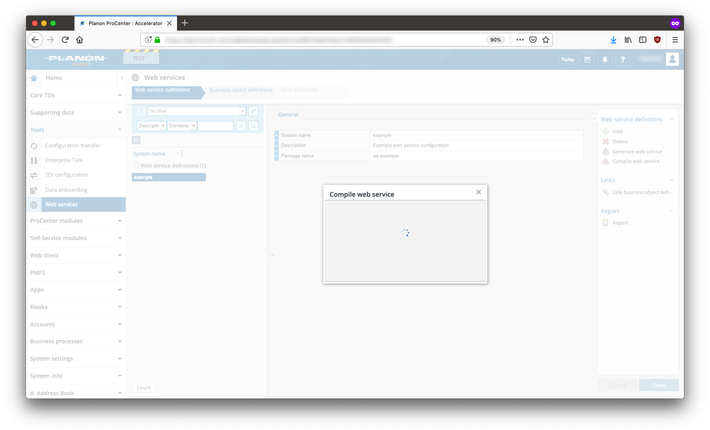
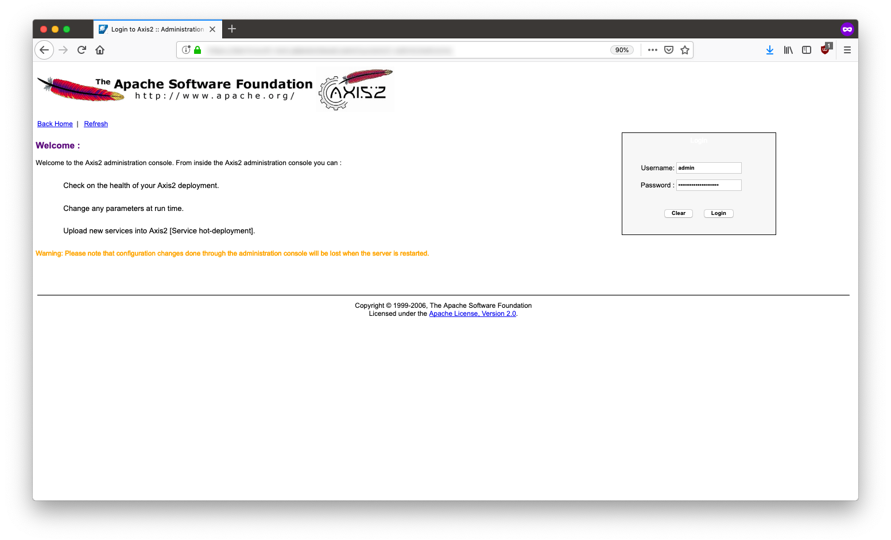
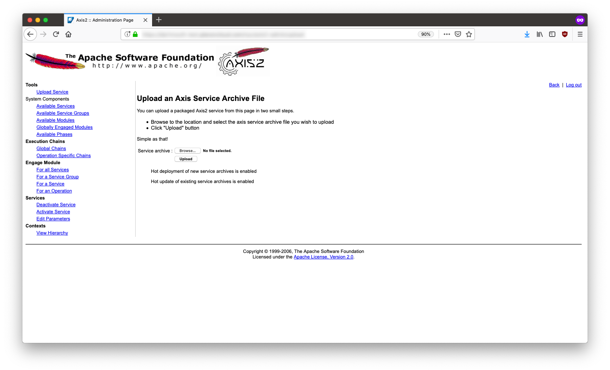
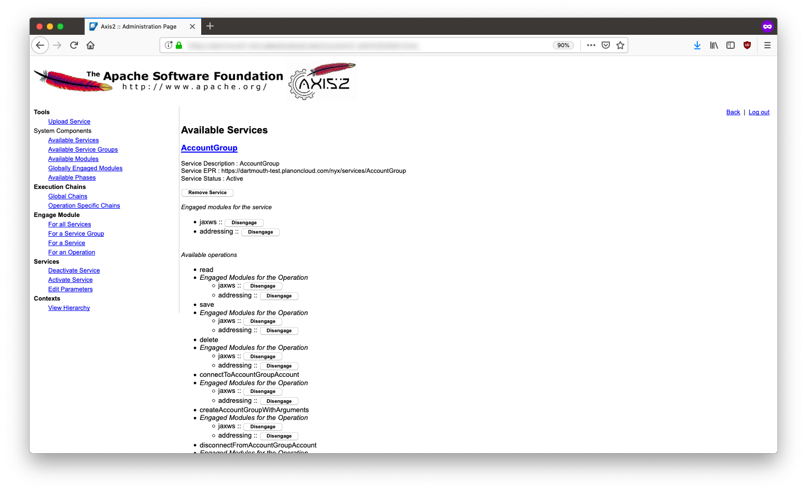

# Planon LDAP Sync

1. [Getting Started](#getting-started)
2. [SOAP API Setup](#soap-api-setup)

## Getting Started

### Requirements

* Python 3.X+

## SOAP API Setup

1. Login to Planon, click **Tools** --> **Web services**
    1. Click **Add** and fill in the required information

    

2. Search for and add the **Account** and **AccountGroup** business objects

    

3. Click **Link field definitions** and add any required definitions, for this example we've added all fields

    

4. Click **Compile web service**, download the generated .jar file

    

5. Login to the Axis2 administration console ```https:/<instance name>.planoncloud.com/nyx/```

    

6. **Browse** to the .jar file and select it, click **Upload**

    >NOTE: If you have an existing web service you may need to delete it, otherwise duplicate methods will be created and errors will be thrown

    ```bash
    # Simple curl example to delete WebDAV files
    curl --user $PLANONWEBDAVUSER:$PLANONWEBDAVPWD https://<instance name>.planoncloud.com/webservices/
    ```

    

7. Verify the SOAP API methods are shown under **Services**

    